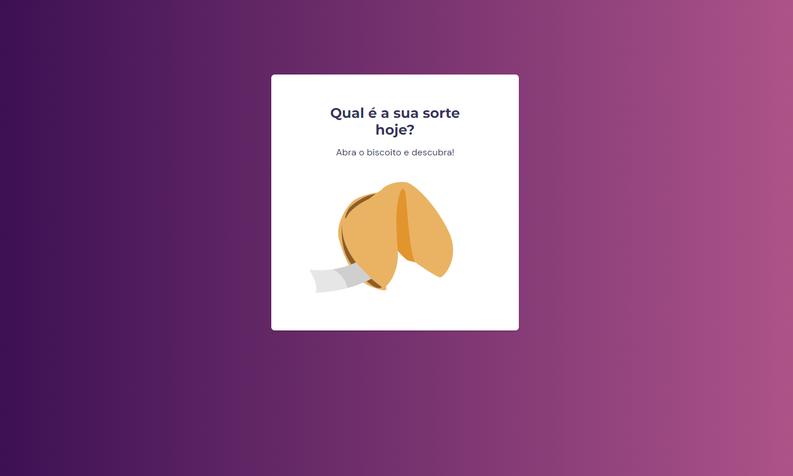
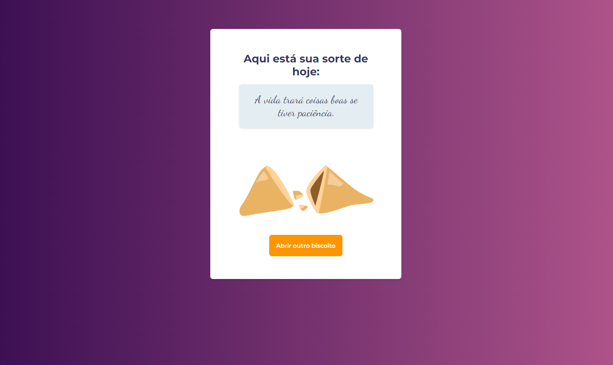

# Biscoito da Sorte
 

> Explorer Stage 5

Projeto feito utilizando os conceitos de HTML, CSS e JavaScript para criar um jogo com frases aleatórias de um biscoito da sorte através do curso da RocketSeat "Explorer".

## [🔗 Clique aqui para acessar o projeto](https://loren175.github.io/biscoito-sorte)

#

## 📕 Layout
- Você pode visualizar o projeto do Figma através [desse link.](https://www.figma.com/community/file/1182751789348533739)

## 🚀 Tecnologias

- HTML
- CSS
- JavaScript
- Git e Github

## 📞 Contato

>rafael.loren175@gmail.com

>+55 (11) 99959-9140

## 👾 Discord

>rafas#7622